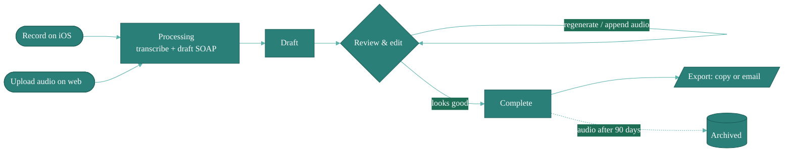

# Encounters

An **encounter** is one appointment: the audio, the transcript, and the SOAP note generated from them. The Encounters page is where you browse everything you've recorded.

Every encounter moves through the same lifecycle, from captured audio to an exported note:

## Filter and search

Filter pills along the top narrow the list by status (Draft, Complete, Archived). The search bar on the right matches patient name, owner, and free text from the transcript.

## Opening an encounter

Click a row to open it. Inside, you'll see the transcript on one side and the SOAP note on the other. See [Review & Edit](/encounters/review-and-edit) for everything you can do there.

## In this section

- [New Encounter](/encounters/new-encounter) — record or upload audio
- [Review & Edit](/encounters/review-and-edit) — edit SOAP notes, regenerate, append audio, export
