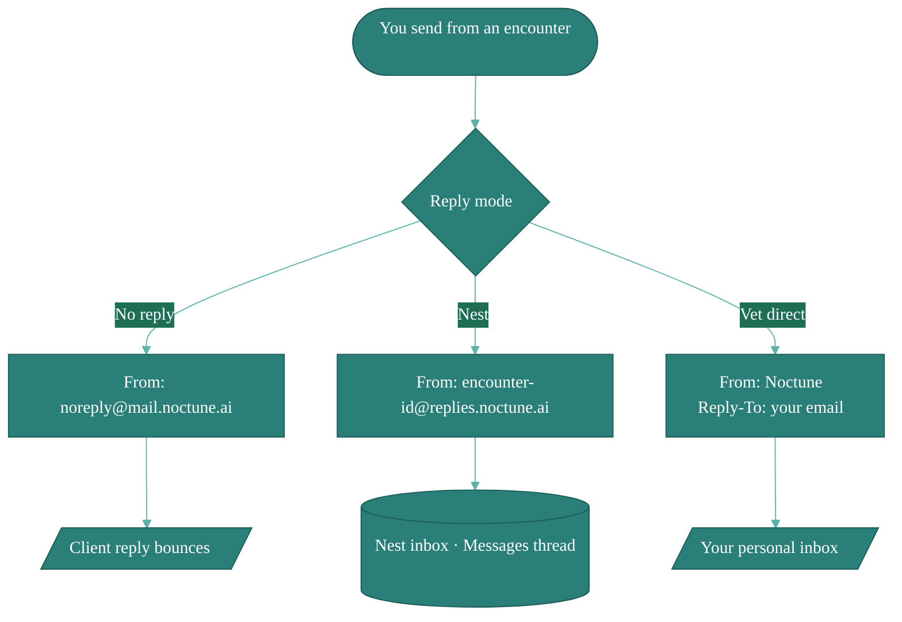

# Messaging & Email Relay

When you email a discharge note, referral, or follow-up from Noctune, you choose how replies get back to you. The choice affects both the client's experience and what (if anything) it costs you.

## The three reply modes

Noctune supports three outbound-email modes:

| Mode           | What the client sees                         | What happens to replies                          | Cost                                    |
| -------------- | -------------------------------------------- | ------------------------------------------------ | --------------------------------------- |
| **No reply**   | From: `noreply@mail.noctune.ai`              | Bounce — client can't reply                      | Free — included with every note         |
| **Nest**       | From: `{encounter-id}@replies.noctune.ai`    | Route into the Nest inbox, tied to the encounter | Included in Lite / Pro / Practice plans |
| **Vet direct** | From: Noctune, Reply-To: your personal email | Go straight to your inbox                        | Included in Lite / Pro / Practice plans |

### No reply (free, included)

The default. Use this when you just need to send something — discharge instructions, a receipt, an FYI — and don't need a response. Replies bounce with a polite message telling the client to call the practice. **No reply sends are free and included with every generated note** on any plan, including pay-per-note.

### Nest (subscription)

The **Nest** is Noctune's bidirectional inbox. Each encounter gets a unique reply address (`{encounter-id}@replies.noctune.ai`), and any reply the client sends routes into the [Messages](/messages) thread for that encounter. This keeps the client's follow-up questions tied to the visit context, which other vets on your team can see.

Nest is included in Lite, Pro, and Practice plans. Pay-per-note accounts can send via No reply only.

### Vet direct (subscription)

If you'd rather have replies go to your personal email inbox, choose Vet direct. This exposes your email address to the client, so it's best for relationships where that's already established. Like Nest, it's included in any subscription plan.

## Choosing a mode

When you compose a discharge or follow-up email, the mode picker appears above the recipient field. The default is **No reply** for one-off courtesy sends.

## Nest inbox

Messages that arrive via Nest show up in both:

- The per-encounter thread (open the encounter → Messages tab)
- The global [Messages](/messages) inbox with an unread badge

Replies from within the app always go back via Nest — once a conversation starts in the Nest, it stays there.

## Your handle inbox

The reply modes above are all about **outbound** sends. There's also an inbound path that doesn't depend on you sending anything first: every vet (and every practice) has a permanent handle address, `{handle}@inbox.noctune.ai`. Anyone — a client, a referring clinic, another vet — can email it directly and the message lands in your [Messages](/messages) inbox, the same place Nest replies arrive.

It's distinct from the reply modes:

- Unlike **Vet direct**, it never exposes your personal email address.
- Unlike **Nest**, it isn't tied to a single encounter — it's your standing address.

See [Mail domains](#mail-domains) for how handles are assigned.

## Mail domains

Noctune splits email across three subdomains so each kind of traffic keeps its own reputation — a client marking an encounter reply as spam never affects your discharge sends or your direct mailbox.

| Subdomain            | Direction     | Used for                                                | Address shape                       |
| -------------------- | ------------- | ------------------------------------------------------- | ----------------------------------- |
| `mail.noctune.ai`    | Outbound only | Transactional sends (`noreply@`). Won't accept replies. | `noreply@mail.noctune.ai`           |
| `replies.noctune.ai` | Inbound       | Per-encounter Nest reply tokens                         | `{encounter-id}@replies.noctune.ai` |
| `inbox.noctune.ai`   | Inbound       | Your handle and your practice's shared inbox            | `{handle}@inbox.noctune.ai`         |

Your **handle** is the address clients and other vets can write to directly. Everyone gets one automatically; you can pick a custom handle on a paid plan, and a practice can claim a shared one (e.g. `valleyvet@inbox.noctune.ai`). Mail to your handle lands in [Messages](/messages) just like Nest replies. Handles are globally unique and, once retired, are never reissued.

## What happens if a subscription lapses

- **No reply** keeps working indefinitely — it's included with every generated note.
- **Nest** and **Vet direct** require an active subscription. If yours lapses, new sends default to No reply and existing Nest threads become read-only until you reactivate.
