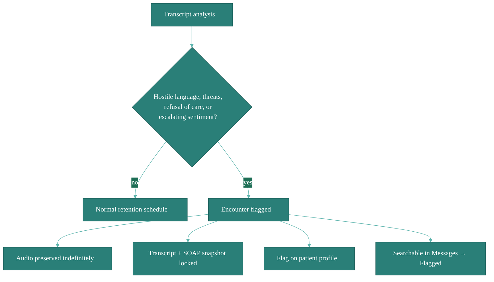

# Noctune Sentinel

Veterinary visits occasionally go sideways — an agitated client, threats, or refusal of care that might later become a dispute. **Noctune Sentinel** watches for these and quietly preserves what happened so you're protected. **This costs you nothing** and is on by default for every account.

## What we flag

During analysis of a transcript, Noctune detects:

- **Hostile language** directed at you, your staff, or the clinic
- **Threats** — physical, legal, or financial
- **Explicit refusal of care** — so there's a clear record of what was offered vs. declined
- **Sentiment trends** that escalate across a conversation

Each flagged encounter gets a small indicator on the encounter card and on the patient's profile.

## What happens automatically

When a visit is flagged:

1. **The audio is preserved indefinitely** — pulled out of the normal retention/archival schedule, no extra cost to you.
2. **A snapshot of the transcript and SOAP note is locked** — edits after the flag fires are tracked as new versions, originals stay intact.
3. **A flag appears on the patient's profile** — future-you (or another vet on the team) sees it before the next visit. See [Patients](/patients).
4. **The encounter is searchable** in the [Messages inbox](/messages) under the "Flagged" filter so you can find it quickly.

None of this shares your data with anyone outside your practice. We don't notify authorities, insurers, or third parties — it's entirely a protective record for you.

## Opting out

You can mute the indicator on any individual encounter if it was a false positive (Encounter → three-dot menu → **Unflag**). The underlying audio preservation and lock stay in place — unflagging only hides the indicator. You can't opt out account-wide, because the protection exists _for_ you.

## Reviewing flagged encounters

The [Messages inbox](/messages) has a **Flagged** filter that surfaces every encounter with an active safety flag, sorted newest first. The patient profile also shows a historical hostile-encounter count so you can read the room before seeing a repeat client.

## What we _don't_ do

- **No recording without your knowledge.** Safety detection runs on audio you already chose to record. It doesn't turn on the mic, extend recording time, or transmit extra data.
- **No sharing.** Flagged data stays in your practice unless you explicitly export or forward it.
- **No AI-generated testimony.** Flags are a signal, not a legal determination. What gets preserved is your own audio and transcript — the source of truth.
